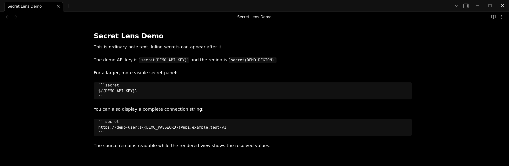
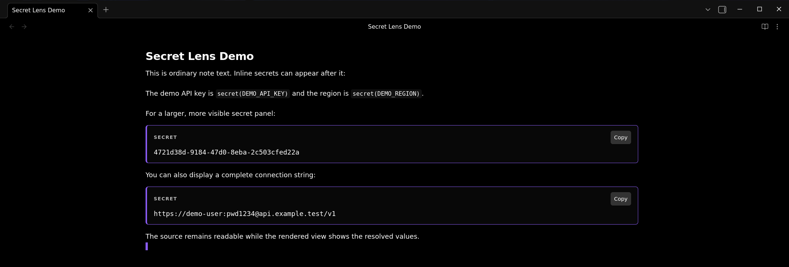
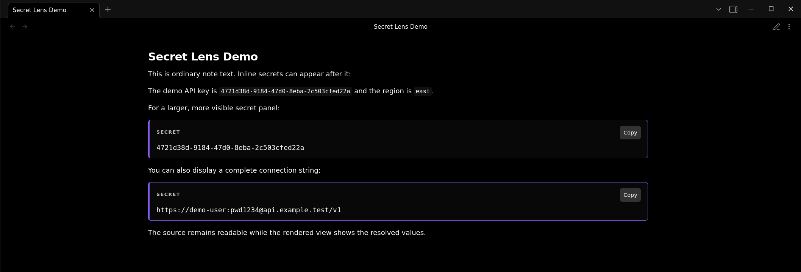

# Secret Lens

This Obsidian plugin renders a dedicated `secret` code block using values from
a `.env` file at the root of the vault. Secret placeholders are only processed
inside this block and are not changed in ordinary text.

````markdown
```secret
${{API_KEY}}
```
````

With this vault-root `.env` file:

```dotenv
API_KEY=example-secret
```

Reading view displays a styled secret panel containing `example-secret`, with a
**Copy** button for copying the resolved value. The Markdown source is not
modified, and missing secrets remain visible as placeholders.

For a compact inline secret, use the explicit `secret(NAME)` form inside inline
code:

```markdown
The API key is `secret(API_KEY)` and the request is ready.
```

Inline secrets are rendered as small accent-colored code components.

The inline form is intentionally specific, so ordinary `${{...}}` text and
inline code are not changed.

Use the command palette action **Secret Lens: Reload secrets from .env**
after changing `.env` while Obsidian is open.

Use **Secret Lens: Create secret** from the command palette, or choose
**Create secret** from the editor right-click menu, to add or update a secret
in `.env`. The command also inserts a ready-to-use `secret` block at the
current cursor position.

Use **Secret Lens: Insert existing secret** to choose a key already in `.env`
and choose how to insert it:

- **Inline**: `` `secret(API_KEY)` ``
- **Multiline**: a fenced `secret` block containing `${{API_KEY}}`

To install it, create `.obsidian/plugins/obsidian-secret-lens/` in your vault and copy
`main.js` and `manifest.json` into that directory. Then enable **Secret Lens**
in Obsidian's Community Plugins settings.

## Views

The source view shows the syntax used to create inline and multiline secrets:



In the editing view, multiline `secret` blocks are rendered as panels while
inline secret syntax remains visible for editing:



In Reading view, both multiline blocks and inline secrets display their
resolved values:



## Printable Example

The file [`example-note.md`](docs/example-note.md) is a fake note that can be copied
into a vault and printed after adding these example values to the vault-root
`.env` file:

```dotenv
DEMO_API_KEY=4721d38d-9184-47d0-8eba-2c503cfed22a
DEMO_REGION=east
DEMO_PASSWORD=pwd1234
```
